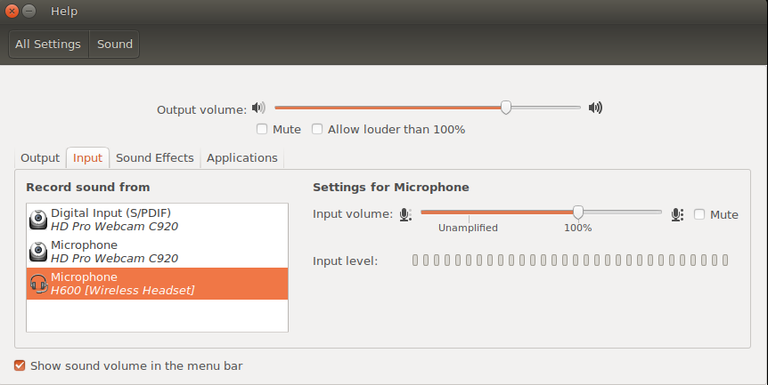

==========================================================
WARNING: This repository is no longer maintained :warning:
==========================================================

This repository will not be updated. The repository will be kept available in read-only mode.

=========================================
 Watson Streaming Speech to Text Example
=========================================

The following is an example of using Watson to real time transcribe
from Speech to Text using the websockets streaming API.

Installation
============

This code is designed to run under python3 in a virtualenv. In order
to get started you need to run the following:

::

   virtualenv -p python3 .venv
   source .venv/bin/activate
   pip install -r requirements.txt

That will build you a clean environment and install the required
pyaudio and websockets libraries for it's use.

Getting Started
===============

This uses the pyaudio interface to abstract talking to audio
interfaces. On the upside, this smooths over a lot of platform
differences.

However, on Linux audio remains a "hard problem". The "default" audio
device that is picked up by pyaudio by default is going to be what
your sound mixer is set to. In Ubuntu, you will need to go to the
Sound settings and set the input to what you want to record from
there.

Credentials
===========

You'll need to sign up for the `Watson STT service`_. As of Sept 2018,
IBM Cloud accounts get 100 minutes / month free.

In order to connect to the Watson streaming server you need an API Key, and to
specify which region your speech to text service was provisioned in (there are
different gateways per region). You can find these on your IBM Cloud console
for the service you have added.

Copy speech.cfg.example to speech.cfg to ensure that's valid.

Expected Output
===============

Once you run transcribe.py with a timeout value (-t) you'll get both
incremental output as data comes back, as well as a final stitching of
things together. The output will look something like this.

::

   ./transcribe.py -t 20
   ALSA lib pcm_dsnoop.c:618:(snd_pcm_dsnoop_open) unable to open slave
   ALSA lib pcm_dmix.c:1041:(snd_pcm_dmix_open) unable to open slave
   ALSA lib pcm.c:2450:(snd_pcm_open_noupdate) Unknown PCM cards.pcm.rear
   ALSA lib pcm.c:2450:(snd_pcm_open_noupdate) Unknown PCM cards.pcm.center_lfe
   ALSA lib pcm.c:2450:(snd_pcm_open_noupdate) Unknown PCM cards.pcm.side
   ALSA lib pcm_dmix.c:1041:(snd_pcm_dmix_open) unable to open slave
   * recording
     we
     twinkle
     twinkle twinkle
     twinkle twinkle
     twinkle twinkle
     twinkle twinkle that
     twinkle twinkle little
     twinkle twinkle little
     twinkle twinkle little star
     twinkle twinkle little star
     twinkle twinkle little star
     twinkle twinkle little star I know
     twinkle twinkle little star I know when
     twinkle twinkle little star I know when you're
     twinkle twinkle little star I know when you're
     twinkle twinkle little star I know when you're what you
     twinkle twinkle little star I know when you're what you are
     twinkle twinkle little star I know when you're what you are
     I
     I
     hi herb
     high above
     high above the
     high above them
     high above them we're
     high up above the world so
     high up above the world so
     high up above the world so %HESITATION
     high up above the world so I
     high up above the world so I like
     high up above the world so I like
     high up above the world so I like
     high up above the world so I like die
     high up above the world so I like time and
     high up above the world so I like time and in
     high up above the world so I like time and in those
     high up above the world so I like diamond in the sky
     high up above the world so I like diamond in the sky
     high up above the world so I like diamond in the sky
     high up above the world so I like diamond in the sky
   * done recording
     twinkle twinkle little star I know when you're what you are high up above the world so I like diamond in the sky

Transcription is far from perfect, but you get to see an example here
of chunking the stream as we go and how it corrects with context.

Note: nursery rhymes / poetry probably really push the context fixing
in terrible directions, but it's the thing that I can repeat over and
over again as a parent of a young child.

.. _Watson STT service: https://console.ng.bluemix.net/catalog/services/speech-to-text/
